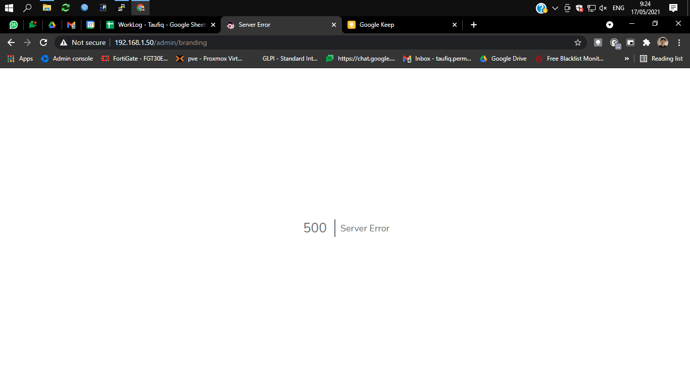
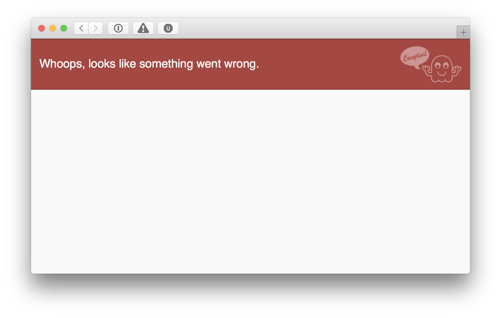

# Snipe IT

### A. Pengenalan

Snipe IT merupakan web based software open source yang berfungsi sebagai Asset Management System, dan karena sifatnya open source pasti otomatis disukai oleh tim IT, hehe.


### B. Fitur Snipe IT

Menurut saya meskipun software ini open source, tetapi menurut saya fiturnya sudah sangat membantu kita dalam melakukan asset management tentunya

**Open Source**

Snipe-IT is open source software. Transparency, security and oversight is at the heart of everything we do. No vendor lock-in again, ever.

**Cloud Hosted**

Our cloud platform offers a 99.99% SLA uptime guarantee, with servers in data centers across the globe for reliability and speed.

**App & Platform Security**

Both Snipe-IT as a software product and our cloud-hosting infrastructure were designed with security at the forefront.

**Frequent Updates**

Snipe-IT is improved constantly, with new releases every few weeks. Bug-fixes and new features ship daily.

**Dedicated Support**

Our full-time in-house support team is ready to answer all technical difficulties customers may encounter with any of our products.

**Powerful REST API**

Our simple and intuitive developer JSON REST API allows you to develop custom automations based on your own individual needs.

Adapun fitur aplikasi yang dapat digunakan adalah sebagai berikut:

* **Lisensi**: Basis data berisi serial number \(SN\), akun, email dan informasi lainnya yang terhubung dengan lisensi dari suatu software komersil/berbayar
* **Bahan habis pakai**: Pendataan barang-barang yang hanya dapat dipergunakan dalam satu kali pemakaian atau barang yang selalu berkurang setelah dipakai. Contoh: kertas folio, kertas print, pensil, pena, pensil, spidol, isi staples, tinta, buku, nota, dll 
* **Aksesoris**: Pendataan barang aksesoris yang dimiliki lembaga/instansi, sifatnya selalu digunakan dan tidak dapat dipinjamkan. Contoh: meja rapat, meja kerja, kursi, air conditioner, dan lembar list barang-barang pada setiap ruangan 
* **Aset**: Pendataan barang-barang yang dapat dipinjamkan ke perseorangan atau kelompok 
* **Pelaporan**: Membuat dan mengarsipkan data-data aset dan aksesoris
* **Pengaturan User**: Pengaturan pengguna dari aplikasi yakni Superadmin, Admin, dan User Tampilan: Snipe-IT menggunakan tampilan responsive yang disesuaikan untuk pengguna mobile dan desktop.

### C. Instalasi Software

Bisa mengikuti buku panduan: [https://snipe-it.readme.io/docs](https://snipe-it.readme.io/docs)




Video: [https://www.youtube.com/watch?v=AHNi9eU9icw](https://www.youtube.com/watch?v=AHNi9eU9icw)

### Metode Instalasi \#1


System Operasi: Ubuntu 20.04

Snipe It v.5.1.5


Snipe it is a versatile asset management sytem – this guide will get you started.

Install a Ubuntu 20.04 LTS server and set a fixed IP – then get you basic packages ready:

```text
apt-get install openssh-server net-tools -y
apt-get update
apt-get upgrade
reboot
```

Then install all the packages needed by SnipeIt

```text
apt-get install php php-json php-mbstring php-tokenizer php-curl php-mysql php-ldap php-zip php-bcmath php-gd php-xml -y
apt-get install mariadb-server -y
apt-get install apache2 -y
apt-get install git curl -y
```

Ensure mysql and apache start up at boot \(and start them\)

```text
systemctl enable mariadb
systemctl enable apache2
systemctl start mariadb
systemctl start apache2
```


### Lanjut Metode Instalasi \#2 \(recommended\)


Create database and user \(here are the values I used  
dbhost: localhost  
dbname: snipeit  
dbuser: snipeituser  
dbpasswd: snipeitpasswd

```text
mysql -u root -p
CREATE DATABASE snipeit_db;
CREATE USER 'snipe_it_user'@'localhost' IDENTIFIED BY 'EXAMPLE_PASSWORD';
GRANT ALL PRIVILEGES ON snipe_it.* TO 'snipe_it_user'@'localhost';
FLUSH PRIVILEGES;
EXIT;
```

Get the software

```text
cd /tmp/
wget https://github.com/snipe/snipe-it/archive/refs/tags/v5.1.5.tar.gz
tar -xvf v.5.1.5.tar.gz

sudo mv v.5.1.5 /var/www/html/snipe-it
```

Now use the sample env file to create one matching your environment

```text
cp .env.example .env

vi .env (these are the lines I set)
APP_TIMEZONE='Europe/Copenhagen'
DB_CONNECTION=mysql
DB_HOST=127.0.0.1
DB_DATABASE=snipeit
DB_USERNAME=snipeituser
DB_PASSWORD=snipeitpasswd
DB_PREFIX=ver1_
DB_DUMP_PATH='/usr/bin'
DB_CHARSET=utf8mb4
DB_COLLATION=utf8mb4_unicode_ci
IMAGE_LIB=gd
```

setup composer to download dependencies:

```text
cd /var/www/html/snipe-it
curl -sS https://getcomposer.org/installer | php
php composer.phar install --no-dev --prefer-source
```


#### PHP Fatal error: Uncaught Error: Class 'Log' not found in /var/www/snipe-it/app/Exceptions/Handler.php:40

Jika terdapat error seperti ini silahkan ubah konfiguras .env

`From` _`GOOGLE_MAPS_API=`_ to _`GOOGLE_MAPS_API=''`_ in `.env`


\`\`

Generate app key \(keep it safe at you might need it later.

```text
sudo php artisan key:generate
```

Now fix all the permissions

```text
chown -R www-data:www-data /var/www/html/snipe-it
chmod -R g-w /var/www/html/snipe-it
chmod -R g+w /var/www/html/snipe-it/storage
chmod -R g+w /var/www/html/snipe-it/public/uploads
```

Create a new apache default config file

```text
sudo cp /etc/apache2/sites-available/000-default.conf /etc/apache2/sites-available/snipe-it.conf
```

Make the content of your new file like this  
\(vi /etc/apache2/sites-available/snipe-it.conf\)

```text
<VirtualHost *:80>

        #Use the email address of whoever is responsible for this server
        ServerAdmin you@youremail.domain

        #this should be the public directory under your snipe-it installation
        DocumentRoot /var/www/html/snipe-it/public

        #this should match the APP_URL in the .env configuration file
        ServerName 192.168.1.161

        <Directory /var/www/html/snipe-it/public>
                Allow From All
                AllowOverride All
                Options -Indexes
        </Directory>

        ErrorLog ${APACHE_LOG_DIR}/error.log
        CustomLog ${APACHE_LOG_DIR}/access.log combined

</VirtualHost>
```

Then disable the old default, enable the new one, add mod\_rewrite and restart apache

```text
a2dissite 000-default.conf
a2ensite snipe-it.conf
a2enmod rewrite
systemctl restart apache2
```

Now hit the webpage and go through the wizard – it will fail on DB create \(seems like a bug as DB is created\) – just press back and when trying agin it sais nothing to migrate then continue.


### Metode Instalasi \#2 \(recommended\)

```text
sudo
wget https://raw.githubusercontent.com/snipe/snipe-it/master/snipeit.sh
chmod 744 snipeit.sh
./snipeit.sh
```

### Troubleshooting






_Notes: Aktifkan mode App Debug : True snipe it pada configuration file \(.env\) yang berada di dalam folder root snipe it untuk mengetahui letak error, dan jangan lupa untuk mengaktifkannya kembali_

```text
cd /var/www/html/snipeit
php artisan config:cache
php artisan config:clear
```

Ketika ingin melakukan setup terdapat pesan kesalahan _HTTP ERROR 500_

> ErrorException file\_put\_contents\(/var/www/html/snipeit/storage/framework/cache/cf/90/cf906e7195218453e4ff6f1bdcdc6b2d9f6cae71\): failed to open stream: **Permission denied**

Hal ini terjadi karena folder **storage** tidak memiliki parameter access yang diperlukan, dan ini cara memperbaikinya

```text
cd /var/www/html/snipeit
sudo chown -R www-data:www-data storage

//Folder Permission
sudo chmod -R 775 <folder_name>

php artisan config:cache
php artisan config:clear
```

Kemudian reload halaman setup snipe it, dan berhasil !


