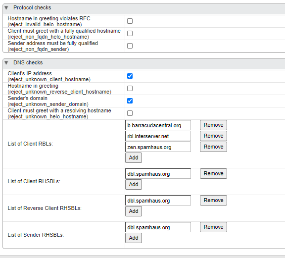

# K.3 Konfigurasi RBL dan RHSBL

## Pendahuluan

Berbagai macam teknik yang dilakukan spammer dalam mengirim email spam ke banyak mail server. Monitoring harus sering dilakukkan pada mail server.

Namun untuk mengurangi spam email yang masuk ke mail server. Kita bisa memanfaatkan RBL’S server dan RHSBL’s server yang ditambahkan pada mail server.

**RBL’s server** ini berisikan daftar IP Address yang pernah melakukkan spam. Jadi, ketika ada email yang masuk, mail server akan mengecek IP Address Email tersebut. 

Apabila ternyata terlisting pada RBL’s Server, maka secara otomatis email tersebut akan di reject.

**RHSBL’s Server** berisikan nama domain yang pernah melakukkan spam.


Saya sarankan Buat akun Barracuda central, untuk mencegah IP Publik email ter-listing RBL Barracuda, pada link berikut: [https://www.barracudacentral.org/account](https://www.barracudacentral.org/account)


Untuk menambahkan Rbl’s Server pada zimbra ada 2 cara, yang pertama melalui zimbra admin yang ke dua melalui console:

## **A.Zimbra Admin**

**Home &gt; Configure &gt; Global Settings &gt; MTA,**

Checklist Pada kolom DNS

Masukkan Rbl’s Server pada List Of Client RBL’s Masukkan Rhsbl’s Server pada List Of Client RHSBL’s




Aktifkan DNS Lookup dan Reverse Lookup


```text
su - zimbra
zmprov mcf +zimbraMtaRestriction "reject_unknown_client_hostname"
zmprov mcf +zimbraMtaRestriction "reject_unknown_sender_domain"
```

## B.Zimbra Console

```text
$root@zimbra: $ zmprov mcf +zimbraMtaRestriction "reject_rbl_client zen.spamhaus.org"
$root@zimbra: $ zmprov mcf +zimbraMtaRestriction "reject_rhsbl_client dbl.spamhaus.org"
```

## Daftar RBL’s

Pilihlah beberapa RBL’s yang dikira cocok. Jangan gunakan semua RBL’s karena semakin banyak proses scanning, akan memperlambat kinerja mail server. Tes beberapa RBL’s Server lihat hasilnya. Berikut daftar RBL’s yang bisa digunakkan.

> **RBL DOMAIN LIST**
>
> 1. b.barracudacentral.org
> 2. bl.emailbasura.org
> 3. bl.spamcannibal.org
> 4. bl.spamcop.net
> 5. blackholes.five-ten-sg.com
> 6. blacklist.woody.ch
> 7. bogons.cymru.com
> 8. cbl.abuseat.org
> 9. cdl.anti-spam.org.cn
> 10. combined.abuse.ch
> 11. combined.rbl.msrbl.net
> 12. db.wpbl.info
> 13. dnsbl-1.uceprotect.net
> 14. dnsbl-3.uceprotect.net
> 15. dnsbl.ahbl.org
> 16. dnsbl.inps.de
> 17. dnsbl.sorbs.net
> 18. drone.abuse.ch
> 19. drone.abuse.ch
> 20. duinv.aupads.org
> 21. dul.dnsbl.sorbs.net
> 22. dul.ru
> 23. dyna.spamrats.com
> 24. dynip.rothen.com
> 25. .dnsbl.sorbs.net
> 26. images.rbl.msrbl.net
> 27. ips.backscatterer.org
> 28. ix.dnsbl.manitu.net
> 29. korea.services.net
> 30. misc.dnsbl.sorbs.net
> 31. noptr.spamrats.com
> 32. ohps.dnsbl.net.au
> 33. omrs.dnsbl.net.au
> 34. orvedb.aupads.org
> 35. osps.dnsbl.net.au
> 36. osrs.dnsbl.net.au
> 37. owfs.dnsbl.net.au
> 38. owps.dnsbl.net.au
> 39. pbl.spamhaus.org
> 40. phishing.rbl.msrbl.net
> 41. probes.dnsbl.net.au
> 42. proxy.bl.gweep.ca
> 43. proxy.block.transip.nl
> 44. psbl.surriel.com
> 45. rbl.interserver.net
> 46. rbl.megarbl.net
> 47. rdts.dnsbl.net.au
> 48. relays.bl.gweep.ca
> 49. relays.bl.kundenserver.de
> 50. relays.nether.net
> 51. residential.block.transip.nl
> 52. ricn.dnsbl.net.au
> 53. rmst.dnsbl.net.au
> 54. sbl.spamhaus.org
> 55. short.rbl.jp
> 56. smtp.dnsbl.sorbs.net
> 57. socks.dnsbl.sorbs.net
> 58. spam.abuse.ch
> 59. spam.dnsbl.sorbs.net
> 60. spam.rbl.msrbl.net
> 61. spam.spamrats.com
> 62. spamlist.or.kr
> 63. spamrbl.imp.ch
> 64. t3direct.dnsbl.net.au
> 65. tor.ahbl.org
> 66. tor.dnsbl.sectoor.de
> 67. torserver.tor.dnsbl.sectoor.de
> 68. ubl.lashback.com
> 69. ubl.unsubscore.com
> 70. virbl.bit.nl
> 71. virus.rbl.jp
> 72. virus.rbl.msrbl.net
> 73. web.dnsbl.sorbs.net
> 74. wormrbl.imp.ch
> 75. xbl.spamhaus.org
> 76. zen.spamhaus.org
> 77. zombie.dnsbl.sorbs.net

## Daftar RHSBL’s

> **RHSBL’s DOMAIN LIST**
>
> 1. dbl.spamhaus.org
> 2. rhsbl.sorbs.net


Saran saya gunakan satu RBL Server saja gunakan RBL Barracudacentral, karena spamhaus terlalu sensitif spam 😅


Sumber Asli: [https://saad.web.id/2017/11/konfigurasi-rbls-dan-rhsbl-pada-zimbra/](https://saad.web.id/2017/11/konfigurasi-rbls-dan-rhsbl-pada-zimbra/)

## Rekomendasi RBL

Additionally, we can add custom RBL that we would like to use. I recommend the following list.

> **RBL DOMAIN LIST**
>
> 1.\) zen.spamhaus.org – [http://www.spamhaus.org/zen/](http://www.spamhaus.org/zen/)  
> 2.\) rhsbl.ahbl.org – [http://www.ahbl.org/documents/rhsbl](http://www.ahbl.org/documents/rhsbl)  
> 3.\) truncate.gbudb.net – [http://www.gbudb.com/truncate/](http://www.gbudb.com/truncate/)  
> 4.\) b.barracudacentral.org – [http://www.barracudacentral.org/account/register](http://www.barracudacentral.org/account/register)  
> 5.\) bl.blocklist.de – [http://www.blocklist.de/en/api.html\#dns](http://www.blocklist.de/en/api.html)  
> 6.\) dnsbl.dronebl.org – [http://dronebl.org/docs/howtouse](http://dronebl.org/docs/howtouse)  
> 7.\) new.spam.dnsbl.sorbs.net – [http://new.spam.dnsbl.sorbs.net/](http://new.spam.dnsbl.sorbs.net/)  
> 8.\) nomail.rhsbl.sorbs.net – [http://nomail.rhsbl.sorbs.net/](http://nomail.rhsbl.sorbs.net/)  
> 9.\) zombie.dnsbl.sorbs.net – [http://zombie.dnsbl.sorbs.net](http://zombie.dnsbl.sorbs.net/)  
> 10.\) srnblack.surgate.net – [http://www.srntools.com/](http://www.srntools.com/)  
> 11.\) dnsbl-1.uceprotect.net – [http://www.uceprotect.net/en/index.php?m=6&s=10](http://www.uceprotect.net/en/index.php?m=6&s=10)  
> 12.\) all.s5h.net – [http://www.usenix.org.uk/content/rbl.html](http://www.usenix.org.uk/content/rbl.html)  
> 13.\) ubl.unsubscore.com – [http://blacklist.lashback.com/](http://blacklist.lashback.com/)

sumber asli: [http://dalaris.com/reversed-dns-and-ip-reputation-in-barracuda-antispam-antivirus-firewall/](http://dalaris.com/reversed-dns-and-ip-reputation-in-barracuda-antispam-antivirus-firewall/)

## Konfigurasi Router

**Block Port 25**

_Users that place multiple computers behind a NAT gateway/firewall system should **block all outgoing port 25** traffic from all computers which have not been explicitly configured and maintained specifically as email servers. A single infected machine sending spam out through a network utilizing NAT can result in blocked email from the whole LAN._

source: barracudacentral.org

**Mikrotik: SMTP Block and Drop IP Address**

/ip firewall filter  
add action=drop chain=forward comment=”BLOCK SPAMMERS OR INFECTED USERS” dst-port=25,26,465,587 protocol=tcp src-address-list=spammer  
add action=add-src-to-address-list address-list=spammer address-list-timeout=1d chain=forward comment=”Detect and add-list SMTP virus or spammers” connection-limit=30,32 dst-port=25,26,465,587 limit=2,1:packet protocol=tcpconnection-limit=30,32 limit=2,1 

Notes: 30 connection and 32 subnet\(single user\) per second 2 mail and 1 buffer

source: [https://vnetlab.net/email-spammer-protection-from-mikrotik/](https://vnetlab.net/email-spammer-protection-from-mikrotik/)

## 

